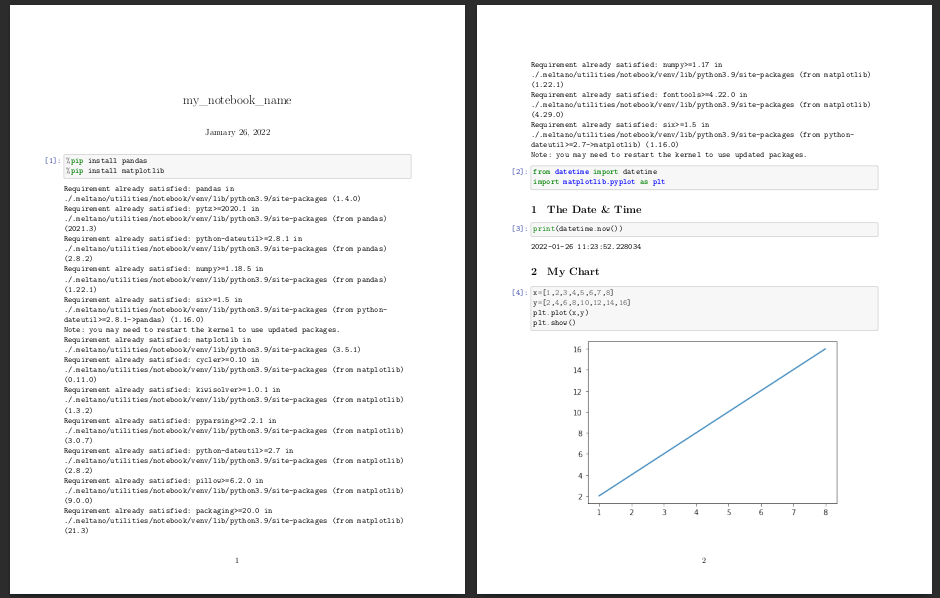
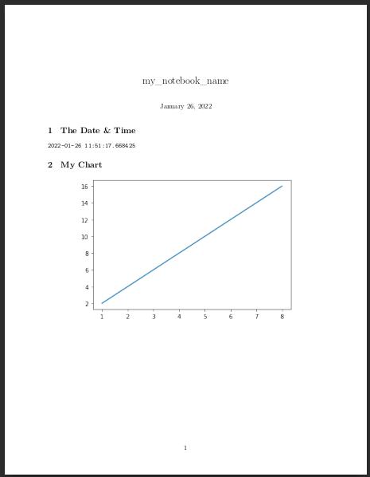

<a href="https://github.com/Matatika/notebook/blob/master/LICENSE"></a>
# notebook
Meltano utility plugin for running and converting Jupyter notebooks.

### System Requirements:

- `pandoc`
- `texlive-xetex`

# Usage

Can be pip installed and used as a python cli package.

Can be added to your Meltano project and used to run notebooks as reports.

## Supported Converting Formats

- PDF

# Commands

## Run

The run command will execute all cells in a notebook or a directory of notebooks and save the outputs.

### Single Notebook
`notebook run path/to/notebook.ipynb`

### Directory of Notebooks

This currently runs all notebooks in the top level of the selected directory.

`notebook run path/to/dir/of/notebooks`

### Single Notebook and Convert
`notebook run path/to/notebook.ipynb --format pdf`

### Directory of Notebooks and Convert
`notebook run path/to/dir/of/notebooks -f pdf`

---

## Convert

The convert command will convert your ipynb notebook to your selected format

### Single Notebook
`notebook convert path/to/notebook.ipynb -f pdf`

### Directory of Notebooks
`notebook convert path/to/dir/of/notebooks -f pdf`

---

## Install

The install command allows you to add requirements used in your notebooks to your python virtual environment or system python, depending on which python invokes the command. 

You also have the option of using `%pip install` inside the notebook your plan on running and converting, though every time you run the notebook it will check all the python packages.

### Install a Requirements.txt
`notebook install path/to/requirements.txt`

---

# Config Settings

Config settings are used by the exporter when your notebook is convertered. You can see a list of setting you can provide in the [nbconvert exporter options documentation](https://nbconvert.readthedocs.io/en/latest/config_options.html#exporter-options)

There is one custom config string you can pass:
- `no-code` 
This config setting remove all code blocks for being rendered in your converted notebook. This can make for a nicely formatted document with just your charts and data your explicitly want to display.

Otherwise you can pass a string of json into the config (-c) click option in the CLI. 

An example that achieves the same thing that `no-code` does:

```json
'{"TemplateExporter": {"exclude_output_prompt": true, "exclude_input": true, "exclude_input_prompt": true}}'
```

Note the use of single quotes around the whole of your config.

---

## More CLI Examples

`notebook run path/to/dir/of/notebooks -f pdf -c '{"TemplateExporter": {"exclude_output_prompt": true, "exclude_input": true, "exclude_input_prompt": true}}'`
- Runs all notebooks in your `path/to/dir/of/notebooks`
- Converts them all to pdf
- Uses a custom config to disable the display of code cells

---

# Converted PDF Layout

The default converted pdf file will contain
- A title which is the name of your notebook file by default
- The date the conversion was run
- The output of your notebook cells
- Page numbers



If you pass `no-code` as the config for the conversion and put `%%capture` at the top of the `%pip install` code cell you get:



# Notebook Formatting Tips & Tricks

## Stop code cell output

Use `%%capture` at the top of each code cell you don't want anything to be output from.

## Force a new page in the output pdf

Import `from IPython.display import display, Latex` and use `display(Latex(r"\newpage"))` in a code cell to force a new page.

## Remove numbers from infront of markdown headers

Add a `{-}` to the end of the markdown header. Example: `# My Title {-}`

## To-Do

- Add ability to convert notebooks into .md files.
- Look into allowing use of custom templates.
